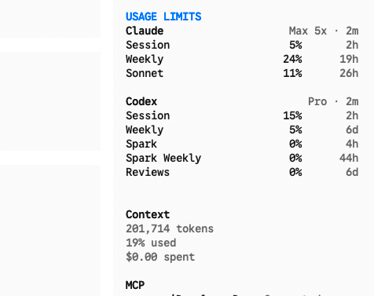

# OpenCode Limits Sidebar Plugin

A lightweight TUI plugin for OpenCode that shows local `openusage` limit data as a compact sidebar table.



## Prerequisites

1.  **OpenCode**: Version `>= 1.3.13`
2.  **OpenUsage**: You must have [OpenUsage](https://github.com/robinebers/openusage) running locally. The plugin strictly polls `http://127.0.0.1:6736/v1/usage`.

## Installation

1. Clone or download this repository.
2. Install dependencies and compile the plugin:
   ```bash
   cd opencode-limits-sidebar
   npm install
   npm run build
   ```
3. Install the plugin globally into your OpenCode configuration:
    ```bash
    opencode plugin /absolute/path/to/opencode-limits-sidebar -g
    ```

## Tell Your Agent

```text
Clone `hkay-dev/opencode-limits-sidebar` into `scratch/clones/opencode-limits-sidebar` with `gh repo clone`, or pull the latest changes if it already exists. Then go to `scratch/clones/opencode-limits-sidebar`, run `npm install` and `npm run build`, and install it globally with `opencode plugin /absolute/path/to/opencode-limits-sidebar -g`.
```

## Usage

Start any new conversation in OpenCode. You'll see `USAGE LIMITS` injected into the right-hand sidebar below the context metrics.

The sidebar shows provider name, plan, last update time, percentage usage, and reset timing for percentage-based limits. It polls `openusage` every 30 seconds.
